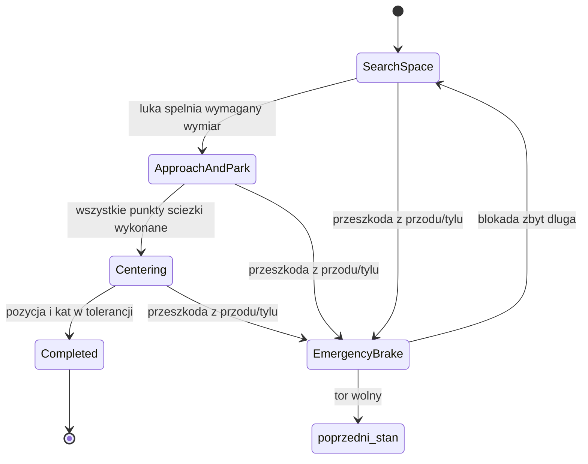

# Projekt Unity 3D - automatyczne parkowanie

Ten folder zawiera gotowa implementacje deterministycznego parkowania w Unity 3D, przygotowana pod wymagania z pliku projektu:

- brak uczenia maszynowego,
- sensoryka oparta o `Physics.Raycast` i `Physics.BoxCast`,
- maszyna stanow FSM z nadrzednym stanem awaryjnego hamowania,
- kinematyczny model pojazdu z limitem skretu i przeliczeniem Ackermanna,
- trzy mapy testowe: parkowanie prostopadle, rownolegle oraz ukosne z dynamiczna przeszkoda,
- proste UI pozwalajace przelaczac mapy w zbudowanej aplikacji.

## Metryczka do uzupelnienia

Osoba 1:

- Imie i nazwisko: ...
- Numer albumu: ...
- Udzial procentowy: ...
- Zakres zadan: sensoryka, fizyka, testy.

Osoba 2:

- Imie i nazwisko: ...
- Numer albumu: ...
- Udzial procentowy: ...
- Zakres zadan: FSM, architektura, dokumentacja.

Osoba 3:

- Imie i nazwisko: ...
- Numer albumu: ...
- Udzial procentowy: ...
- Zakres zadan: sterowanie, kinematyka, mapy.

## Jak uruchomic

1. Otworz folder projektu w Unity `6000.5.0f1`.
2. Otworz scene `Assets/Scenes/SampleScene.unity`.
3. Nacisnij Play. Symulacja utworzy sie automatycznie przez `AutoParkingBootstrap`.
4. W lewym gornym rogu wybierz mape 1, 2 albo 3. Klawisze `1`, `2`, `3` robia to samo, a `R` restartuje aktualna mape.

## Co jest zaimplementowane

Glowny plik kodu to:

`Assets/AutoParking/Scripts/AutoParkingSimulation.cs`

Najwazniejsze czesci:

- `ParkingSimulation` - startuje symulacje, buduje mapy i pokazuje UI.
- `ParkingEnvironmentBuilder` - tworzy trzy srodowiska testowe z przeszkodami.
- `ParkingAgent` - kontekst samochodu, laczy sensory, kontroler i maszyne stanow.
- `ParkingSensorRig` - ograniczony zestaw wirtualnych czujnikow bocznych, przednich i tylnych.
- `ParkingSpaceScanner` - wykrywa wolne luki na podstawie odczytow sensorow, bez czytania gotowych koordynatow miejsca parkingowego.
- `VehicleController` - kinematyczny model rowerowy z limitem skretu i funkcja Ackermanna.
- `SearchSpaceState`, `ApproachAndParkState`, `CenteringState`, `CompletedState`, `EmergencyBrakeState` - stany FSM.
- `ParkingPathPlanner` i `PathFollower` - wyliczanie i sledzenie manewru parkowania.
- `MovingObstacle` - dynamiczna przeszkoda na mapie 3.

## Diagram FSM

## Decyzje projektowe

Pojazd nie zna globalnego polozenia pustego miejsca. Jedzie wzdluz pasa i za pomoca bocznego BoxCastu sprawdza, czy przy boku auta jest wystarczajaco gleboka wolna przestrzen. Scanner przyjmuje luke dopiero po tym, jak najpierw wykryje przeszkode, dzieki czemu nie wybiera pustej przestrzeni przed rzedem miejsc. Dlugosc luki jest liczona po kierunku jazdy od punktu rozpoczecia do punktu zakonczenia odczytu "wolne".

Sterowanie jest uproszczonym modelem kinematycznym. Samochod ma szerokosc 2 m, dlugosc 4.5 m, rozstaw osi 2.7 m i maksymalny skret 35 stopni. Funkcja `GetAckermannWheelAngles` przelicza glowny kat skretu na kat kola wewnetrznego i zewnetrznego.

Mapa 3 ma dynamiczny pojazd blokujacy alejke. Gdy czujnik przedni albo tylny wykryje przeszkode w kierunku ruchu, FSM naklada `EmergencyBrakeState` na stos. Po zwolnieniu toru poprzedni stan jest wznawiany.

## Znane ograniczenia

- To demonstrator algorytmu i architektury, nie dopracowany model fizyczny samochodu wyczynowego.
- Pojazd uzywa kinematyki i kinematic Rigidbody, wiec kolizje sa glownie kontrolowane przez sensory i logike hamowania.
- Mapa 3 jest powtarzalnym przypadkiem dynamicznym. Przed prezentacja warto przetestowac inne czasy startu przeszkody.
- Jesli prowadzacy dostarczy wlasne mapy, najlepiej zachowac podobna skale metrowa i ustawic start auta wzdluz pasa ruchu.

## Co musisz zrobic po swojej stronie

1. Uzupelnij metryczke projektu: imiona, nazwiska, numery albumow, procentowy udzial i lista zadan.
2. Zaloz publiczne repozytorium GitHub albo udostepnij je prowadzacemu.
3. Dodaj projekt do repozytorium z Unity `.gitignore` i rob commity po kazdym sensownym etapie.
4. W Unity wyeksportuj paczke `.unitypackage`: zaznacz folder `Assets/AutoParking`, kliknij prawym przyciskiem i wybierz `Export Package`.
5. Zbuduj aplikacje Windows albo WebGL. W buildzie wystarczy `SampleScene`, bo symulacja tworzy sie automatycznie.
6. Nagraj 2-3 minuty filmu bez ciecia: uruchomienie, mapa 1, mapa 2, mapa 3, widoczne UI i reakcja na przeszkode.
7. W dokumentacji PDF dopisz wlasne dane oraz szczera sekcje z obserwacjami z testow.
